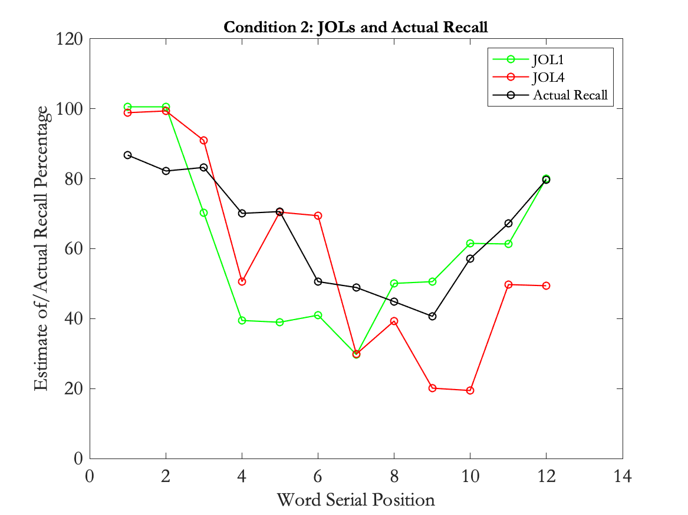
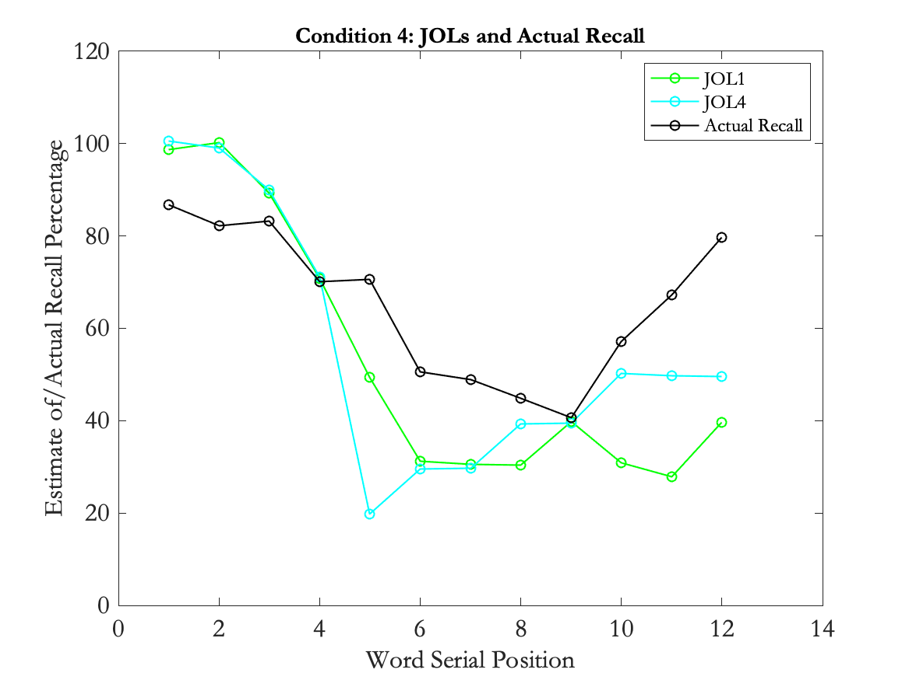
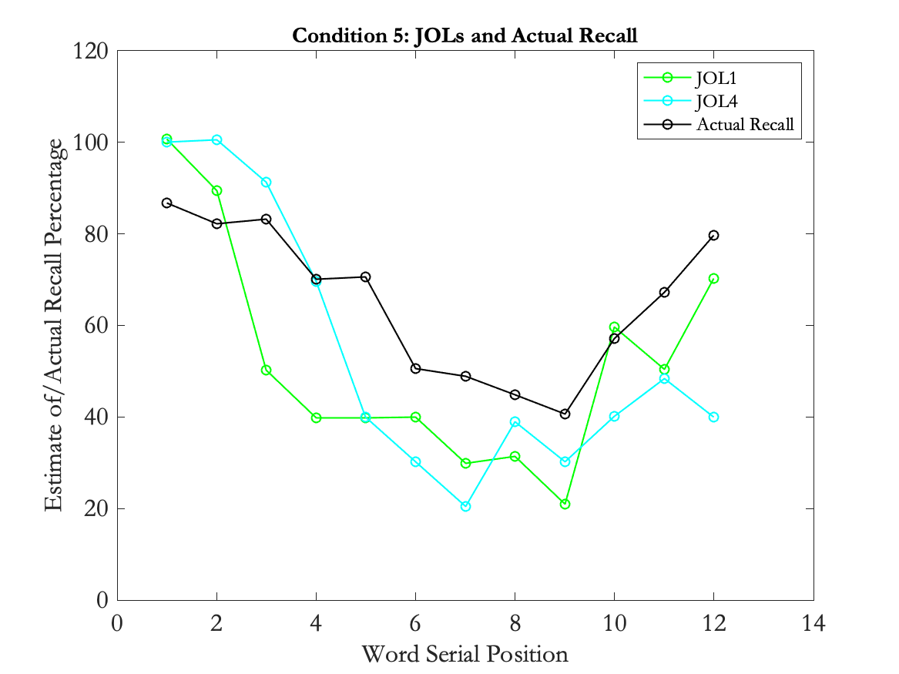
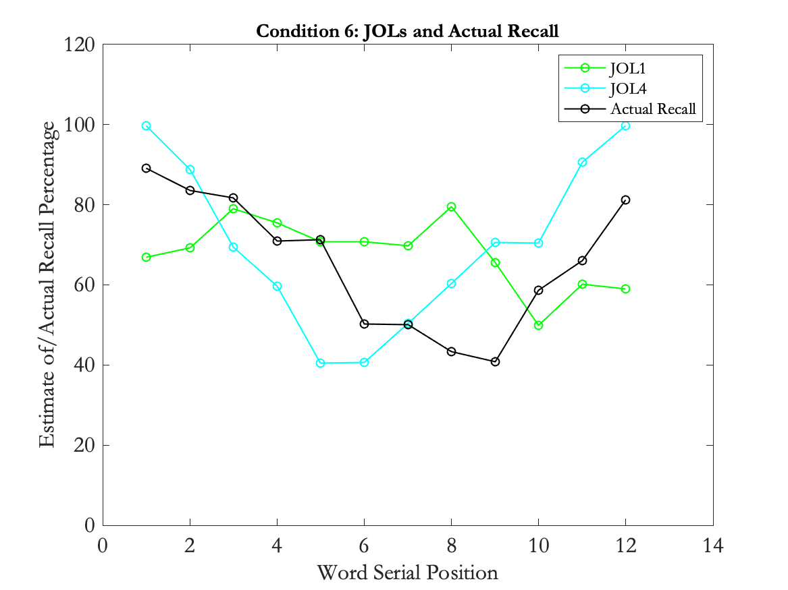

# Judgments of Learning and The Serial Position Effect
#### A MATLAB PROJECT BY CLAIRE DINAUER || JUNE 9, 2020

> This program runs a free recall task, in which participants must make Judgments of Learning (JOLs) for how likely they think they are to recall words on a later recall test. The research question is: "Will people make more accurate JOLs that are reflective of the Serial Position effect if they make a JOL before or after a word is presented? Does font size influence our JOLs and actual recall?"

> **Two Independent Variables:**
> 1. When JOL is Made: Before Word Presentation vs After Word Presentation
> 2. Font Size: Words are Same Size vs Words are Different Sizes

> **Dependent Variables:**
> 1. JOLs made on each trial (percentage of 0 to 100)
> 2. Actual recall of words  (percentage of 0 to 100)

> **Conditions are as follows:**
> - Condition 1: JOLs are made after each word and font size is constant
> - Condition 2: JOLs are made after each word and font size is varied
> - Condition 3: JOLs are made before each word and font size is constant
> - Condition 4: JOLs are made before each word and font size is varied
> - Condition 5: JOLs are made before each word, font size is constant, and position number is included
> - Condition 6: JOLs are made before each word, font size is varied, and position number is included

## Research Question 
How does manipulating intrinsic factors and the timing in which someone makes a Judgment of Learning (JOL) affect predictions of later recall ability, and can individuals demonstrate learning of the Serial Position Effect when predicting how well they will recall information in the future whether or not serial position is visibly available to them?

## Background Research
For my experiment, I explored concepts of metacognition in terms of how we make judgments of learning (JOLs) and to what extent these JOLs reflect our actual learning abilities. A JOL is an estimate that we make with regard to how likely we think we are to successfully recall a piece of information in the future. Typically, humans recall information according to the Serial Position Effect, yet many people are unaware of it. Instead, humans tend to focus on intrinsic factors of information they encode (i.e. small or large font, or meaning of the word) rather than extrinsic factors (i.e. word position) to predict how well they will recall it later. I gathered much of this information from research by Asher Koriat (1997) and Alan Castel (2008), whose studies focused on ​metacognition in terms of how we make JOLs, and in which circumstances our JOLs do versus do not reflect actual recall of information. Koriat's research suggested that we use two different cues when making JOLs: intrinsic cues and extrinsic cues. People put more weight on intrinsic factors by assuming that they will better remember words in large fonts than smaller fonts. However, the serial position effect, which is reflective of extrinsic factors, tends to be the largest dictator of whether words from a list are remembered, and font size has little to no role when recalling words. Castel's experiments focused on testing whether students are aware of primacy and recency effects (serial position effects) when making JOLs. Castel manipulated whether participants made JOLs before or after seeing a word and whether position number was visible. I combined concepts of these experiments to see if manipulating intrinsic factors of words (i.e. small or large font size) would affect people's JOLs, as well as see if study participants would be able to learn and use extrinsic cues (i.e. serial position information) to adjust their JOLs to reflect their recall of words as accurately as possible.

## Experimental Design
I had three main independent variables: (1) whether words were a consistent font size or different font sizes, (2) when JOLs were made (before or after each word), and (3) whether serial position number was present. My dependent variable was participants’ JOLs and actual recall percentages. I ran six conditions, in which JOL timing was manipulated, font size was manipulated, and position number was eventually included. Font size was constant in conditions 1, 3, and 5, and was varied in conditions 2, 4, and 6. In conditions 1 and 2, participants made JOLs after each word. In conditions 3-6, participants made JOLs before each word. In conditions 5 and 6, serial position number was included. I recorded JOLs, actual recall, and response times for each condition. I also recorded participants’ JOLs made based on whether font size was large or small to be compared to the actual recall percentage of these words.

## Predicted Results
I expect that manipulating font size in addition to manipulating when subjects make JOLs will slow down the learning process or recognition of the serial position effect when recalling words, as the larger font size would create an illusion of better learning. When making JOLs after a word is presented, I expect that participants will not adjust their JOLs across trials in accordance with serial position, as they will be focused on intrinsic factors of the words to guide their judgments. However, participants will likely adjust their JOLs across trials when making JOLs before each word is presented, as they will be forced to think about the position of the word in the list (an extrinsic factor) and thereby consider serial position effects. Moreover, participants will make their most accurate JOLs when the serial position of a word is visible since they can more easily consider the serial position effect when aware of where they are in a list. Participants are unable to consider item-specific properties when they cannot see the word, and so they adjust their JOLs in accordance with word position. Moreover, participants will likely demonstrate no significant difference in word recall based on font size. However, they may make lower JOLs when knowingly presented with small font words and slightly larger JOLs when presented with large font words because it is easy to consider the font size as indicative of later recall ability.

## Visualization of Predicted Results

**Condition #1:** Consistent Font Size and JOL Made Before Each Word

**Condition #2:** Varied Font Size and JOL Made Before Each Word

**Condition #3:** Consistent Font Size and JOL Made After Each Word

**Condition #4:** Varied Font Size and JOL Made After Word

**Condition #5:** Consistent Font Size, JOL Made After Word, and Serial Number Included

**Condition #6:** Varied Font Size, JOL Made After Word, and Serial Number Included

